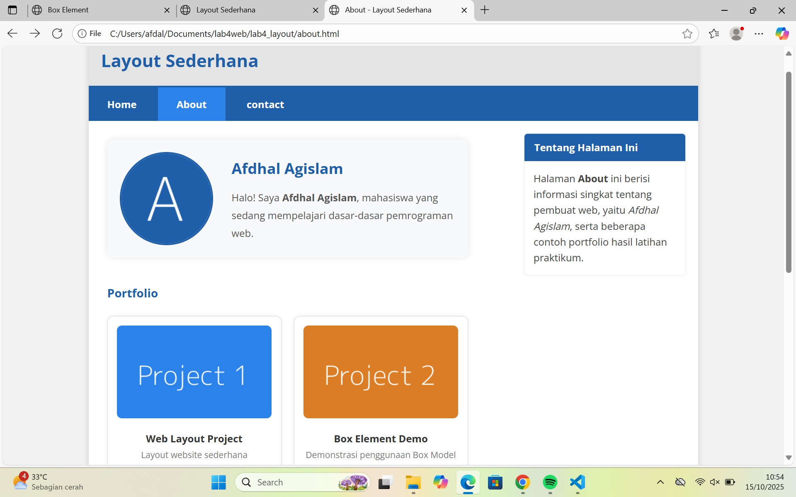
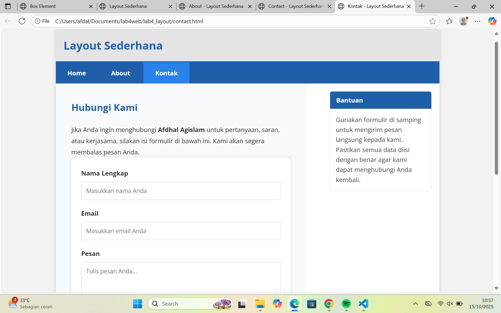
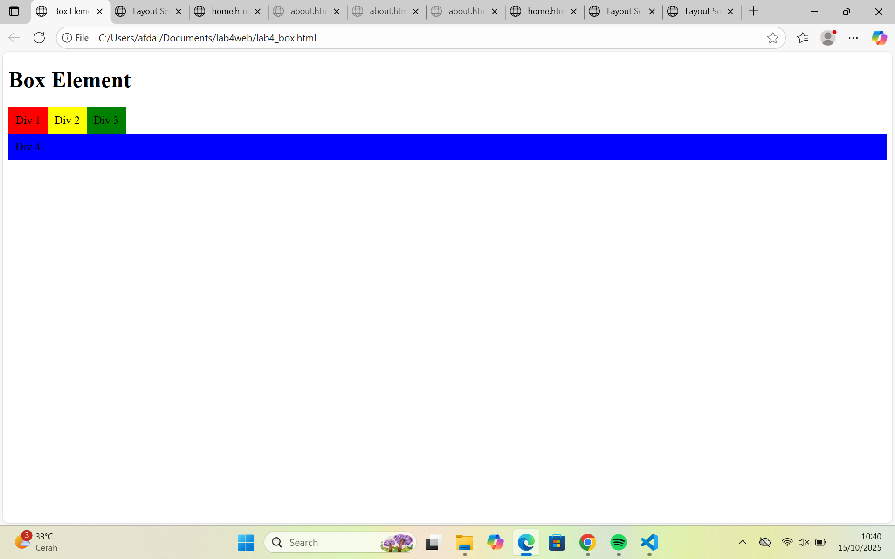
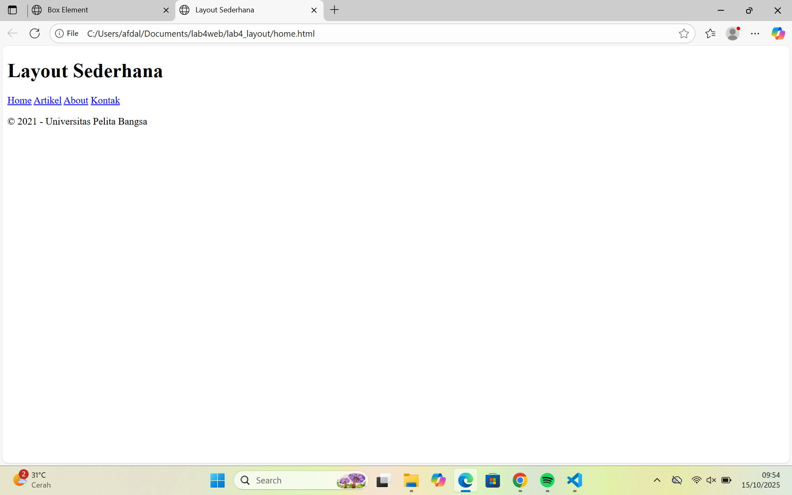

#  Praktikum 4 - CSS Layout

##  Tujuan
Pada praktikum ini, mahasiswa diharapkan mampu:
1. Memahami struktur dasar pembuatan layout website.  
2. Mengenal dan menerapkan konsep **Box Element** dalam HTML dan CSS.  
3. Menggunakan **CSS Float Property** untuk mengatur posisi elemen.  
4. Memahami **HTML5 Semantic Element** dalam membangun struktur halaman.  
5. Membuat **layout web sederhana** menggunakan kombinasi HTML dan CSS.

---

##  Langkah-langkah Praktikum

### 1️⃣ Persiapan Awal
- Buka **VS Code** atau text editor lain.  
- Buat folder baru bernama **Lab4Web**.  
- Buat file HTML baru bernama `lab4_box.html`.

```html
<!DOCTYPE html>
<html lang="en">
<head>
    <meta charset="UTF-8">
    <meta name="viewport" content="width=device-width, initial-scale=1.0">
    <title>Box Element</title>
</head>
<body>
    <header>
        <h1>Box Element</h1>
    </header>
</body>
</html>
```
## Penjelasan
Langkah ini membuat struktur HTML dasar yang akan digunakan untuk percobaan Box Element.

### 2️⃣ Membuat Box Element

Tambahkan elemen div di dalam <section> untuk membuat beberapa box.
```html
<section>
    <div class="div1">Div 1</div>
    <div class="div2">Div 2</div>
    <div class="div3">Div 3</div>       
</section>
```
## Tambahkan code css di bagian <head>:
```html
<style>
    div {
        float: left;
        padding: 10px;
    }
    .div1 { background: red; }
    .div2 { background: yellow; }
    .div3 { background: green; }
</style>
```
## Penjelasan
Kode di atas membuat tiga kotak sejajar menggunakan CSS float. Setiap kotak diberi warna berbeda agar terlihat jelas.

### 3️⃣ Mengatur Clearfix Element
Tambahkan elemen tambahan untuk melihat efek dari properti clear.
```html
<div class="div4">Div 4</div>
.div4 {
    background-color: blue;
    clear: left;
    float: none;
}
```
## Penjelasan
Properti clear: left digunakan agar “Div 4” tampil di bawah tiga kotak sebelumnya, bukan sejajar dengan mereka.

### 4️⃣ Membuat Layout Sederhana

Buat folder baru bernama lab4_layout, lalu buat dua file:
## 1.home.html
## 2.style.css
Isi file home.html sebagai berikut:
```html
<!DOCTYPE html>
<html lang="en">
<head>
    <meta charset="UTF-8">
    <meta name="viewport" content="width=device-width, initial-scale=1.0">
    <title>Layout Sederhana</title>
    <link rel="stylesheet" href="style.css">
</head>
<body>
    <div id="container">
        <header><h1>Layout Sederhana</h1></header>
        <nav>
            <a href="home.html" class="active">Home</a>
            <a href="artikel.html">Artikel</a>
            <a href="about.html">About</a>
            <a href="kontak.html">Kontak</a>
        </nav>
        <section id="hero"></section>
        <section id="wrapper">
            <section id="main"></section>
            <aside id="sidebar"></aside>
        </section>
        <footer>
            <p>&copy; 2021 - Universitas Pelita Bangsa</p>
        </footer>
    </div>
</body>
</html>
```
## Penjelasan
Struktur ini menggunakan HTML5 Semantic Elements seperti <header>, <nav>, <section>, <aside>, dan <footer> untuk membuat layout yang lebih terstruktur.

### 5️⃣ Styling Layout
Tambahkan ke file style.css:
```css
/* Reset */
* { margin: 0; padding: 0; }

body {
    font-family: 'Open Sans', sans-serif;
    color: #5a5a5a;
}

#container {
    width: 980px;
    margin: 0 auto;
    box-shadow: 0 0 1em #ccc;
}

/* Header */
header { padding: 20px; }
header h1 { color: #b5b5b5; }

/* Navigasi */
nav {
    display: block;
    background-color: #1f5faa;
}
nav a {
    padding: 15px 30px;
    display: inline-block;
    color: #fff;
    text-decoration: none;
}
nav a.active, nav a:hover {
    background-color: #2b83ea;
}
```
## Penjelasan
Bagian ini mengatur tampilan halaman agar memiliki warna, jarak, dan bayangan yang rapi.

### 6️⃣ Membuat Hero Panel
Tambahkan di bawah navigasi:
```html
<section id="hero">
    <h1>Hello World!</h1>
    <p>Lorem ipsum dolor sit amet, consectetur adipiscing elit.</p>
    <a href="#" class="btn btn-large">Learn more »</a>
</section>
#hero {
    background-color: #e4e4e5;
    padding: 50px 20px;
    margin-bottom: 20px;
}
#hero h1 { font-size: 35px; }
#hero p { font-size: 18px; line-height: 25px; }
```
## Penjelasan
Bagian hero digunakan untuk menampilkan pesan utama pada halaman utama, biasanya sebagai pengantar website.

### 7️⃣ Mengatur Main Content & Sidebar
Tambahkan CSS berikut:
```css
#wrapper { margin: 0; }
#main {
    float: left;
    width: 640px;
    padding: 20px;
}
#sidebar {
    float: left;
    width: 260px;
    padding: 20px;
}
```
## Penjelasan
Bagian ini membagi halaman menjadi dua kolom — main content dan sidebar — menggunakan teknik float layout.

### 8️⃣ Membuat Sidebar Widget
Tambahkan ke dalam <aside id="sidebar">:
```html
<div class="widget-box">
    <h3 class="title">Widget Header</h3>
    <ul>
        <li><a href="#">Widget Link</a></li>
        <li><a href="#">Widget Link</a></li>
    </ul>
</div>
.widget-box {
    border: 1px solid #eee;
    margin-bottom: 20px;
}
.widget-box .title {
    padding: 10px;
    background-color: #428bca;
    color: #fff;
}
```
## Penjelasan
Widget ini menampilkan daftar tautan atau informasi tambahan di bagian sidebar.

### 9️⃣ Mengatur Footer
Tambahkan CSS berikut:
```css
footer {
    clear: both;
    background-color: #1d1d1d;
    padding: 20px;
    color: #eee;
}
```
## Penjelasan
Footer menutup halaman dan memberikan informasi hak cipta atau kontak singkat.

### 🔟 Menambahkan Konten Artikel
Tambahkan ke <section id="main">:
```html
<article class="entry">
    <h2>First featurette heading.</h2>
    
    <p>Lorem ipsum dolor sit amet, consectetur adipiscing elit.</p>
</article>
.entry img {
    float: left;
    border-radius: 5px;
    margin-right: 15px;
}
.entry h2 { margin-bottom: 20px; }
.entry p { line-height: 25px; }
```
## Penjelasan
Bagian artikel menampilkan konten utama dalam layout dengan gambar di sisi kiri dan teks di sisi kanan.

### Tugas
## 1. Tambahkan layout untuk menu About (berisi deskripsi dan portfolio).
## 2. Tambahkan layout untuk menu Contact (berisi form: nama, email, pesan, dll).

##  Tugas 1 - Halaman About

###  Deskripsi Umum
Halaman **About** merupakan pengembangan dari layout utama yang dibuat pada Praktikum 4.  
Tujuan dari halaman ini adalah menampilkan **profil pembuat website** serta **beberapa contoh portfolio proyek** hasil latihan.  
Halaman ini tetap menggunakan struktur layout utama (`header`, `nav`, `main`, `sidebar`, dan `footer`), tetapi dengan **konten dan gaya tampilan yang lebih personal**.

---

###  Struktur Halaman
Bagian utama pada halaman **About** terdiri dari:

1. **Header**  
   Berfungsi menampilkan judul situs “Layout Sederhana” agar konsisten dengan halaman lainnya.  

2. **Navigasi (Navbar)**  
   Berisi tautan ke halaman Home, About, dan Contact.  
   Menu *About* ditandai aktif karena halaman ini sedang dibuka.  

3. **Bagian Utama (Main Content)**  
   - Menampilkan **profil Afdhal Agislam**, yang berisi foto dan deskripsi singkat.  
   - Di bawah profil terdapat bagian **Portfolio**, yang menampilkan tiga proyek hasil latihan:  
     - Web Layout Project  
     - Box Element Demo  
     - Personal Web Design  
   Setiap proyek ditampilkan dalam bentuk kartu (card) dengan gambar dan keterangan singkat.  

4. **Sidebar**  
   Berisi widget berjudul *Tentang Halaman Ini* yang memberikan penjelasan tambahan tentang isi halaman dan tujuan pembuatannya.  

5. **Footer**  
   Menampilkan informasi hak cipta dengan nama pembuat web: *Afdhal Agislam – Universitas Pelita Bangsa (2025)*.  

---

###  Screenshot Halaman About
Berikut tampilan hasil akhir halaman **About**:


```
```
### Tugas 2 - Halaman Contact

###  Deskripsi Umum
Halaman **Contact (Kontak)** merupakan tugas kedua dari Praktikum 4 – CSS Layout.  
Tujuan pembuatan halaman ini adalah menyediakan **formulir interaktif** bagi pengunjung agar dapat menghubungi pembuat website, memberikan saran, pertanyaan, atau permintaan kerja sama.  
Halaman ini menggunakan struktur layout yang sama seperti halaman utama (`home.html`) dan halaman `about.html`, namun memiliki isi dan gaya khusus yang difokuskan pada komunikasi dengan pengguna.

---

###  Struktur Halaman
Secara keseluruhan, halaman **Contact** terdiri dari beberapa bagian penting:

1. **Header**  
   Menampilkan judul situs “Layout Sederhana” di bagian atas halaman agar tetap konsisten dengan desain halaman lainnya.  

2. **Navigasi (Navbar)**  
   Menyediakan tautan ke halaman *Home*, *About*, dan *Kontak*.  
   Pada halaman ini, menu *Kontak* diberikan tanda aktif (highlight) agar pengguna tahu bahwa halaman ini sedang dibuka.  

3. **Konten Utama (Main Content)**  
   Bagian utama berisi:
   - **Judul halaman “Hubungi Kami”** dan paragraf pembuka yang menjelaskan tujuan dari halaman ini.  
   - **Formulir kontak** dengan kolom input:  
     - **Nama Lengkap**  
     - **Email**  
     - **Pesan**  
     Setiap kolom memiliki label yang jelas dan wajib diisi sebelum mengirimkan pesan.  
   - Di bawah formulir terdapat bagian **Informasi Kontak**, yang memuat:  
     - Nama: *Afdhal Agislam*  
     - Email: *afdhal.agislam@example.com*  
     - Alamat: *Kp. Mengker, Kecamatan Jonggol, Kabupaten Bogor*  
     - Akun Instagram: *@afdhalagislam*  
     Bagian ini berfungsi sebagai kontak langsung jika pengguna ingin menghubungi melalui media lain.  

4. **Sidebar**  
   Sidebar berisi widget dengan judul *“Bantuan”*, berisi penjelasan singkat tentang cara menggunakan formulir dengan benar.  
   Tujuannya adalah untuk membantu pengguna agar tidak salah dalam mengisi data.  

5. **Footer**  
   Terletak di bagian bawah halaman, menampilkan teks hak cipta dengan nama pembuat web dan tahun pembuatan:  
   “© 2025 - Afdhal Agislam | Universitas Pelita Bangsa”.

---
###  Screenshot Halaman Contact
Berikut hasil tampilan akhir dari halaman **Contact (Kontak)**:
```
```

```
```
###  Screenshot Hasil
```
```

```
```
###  Screenshot Hasil


### 🖼️ Screenshot Layout Sederhana (Home)


### 🖼️ Screenshot Box Element


